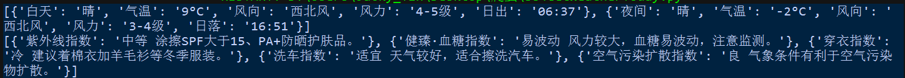
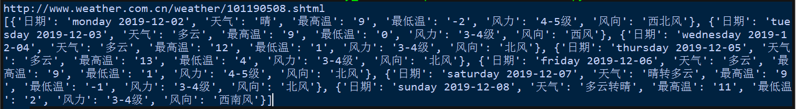

# www.weather.com.cn 
# git url:https://github.com/prowerInJava/www.weather.com.cn.git

<h1>BeautifulSoup4 爬取中国天气网</h1>
<h3>getCityMessage</h3>

用于解析city.json文件，处理传入的城市名称

<ul>
<li>loadFile(self)：加载json文件</li>
<li>getCode(self)：将传入的城市名返回城市代码</li>
<li>getCName(self)：将传入的城市名或pinyin或城市代码转成中文</li>
<li>getPinyin(self)：将传入的城市名或城市代码转成pinyin</li>
<li>getProvince(self)：将传入的城市名获取省份</li>
</ul>

<h3>getUrlSource</h3>

用于加载URL，返回网页的text文本

<h3>bs4GetWeatherToday()</h3>

将传入的text文本解析

<ul>
<li>getToday(self)：返回当天的天气情况</li>
<li>getLifeTips(self)：返回当天的生活指南</li>
</ul>
</img>

<h3>bs4GetWeather7d()</h3>

将传入的text文本解析

<ul>
<li>get7d(self)：返回7天的天气情况</li>
</ul>
</img>

